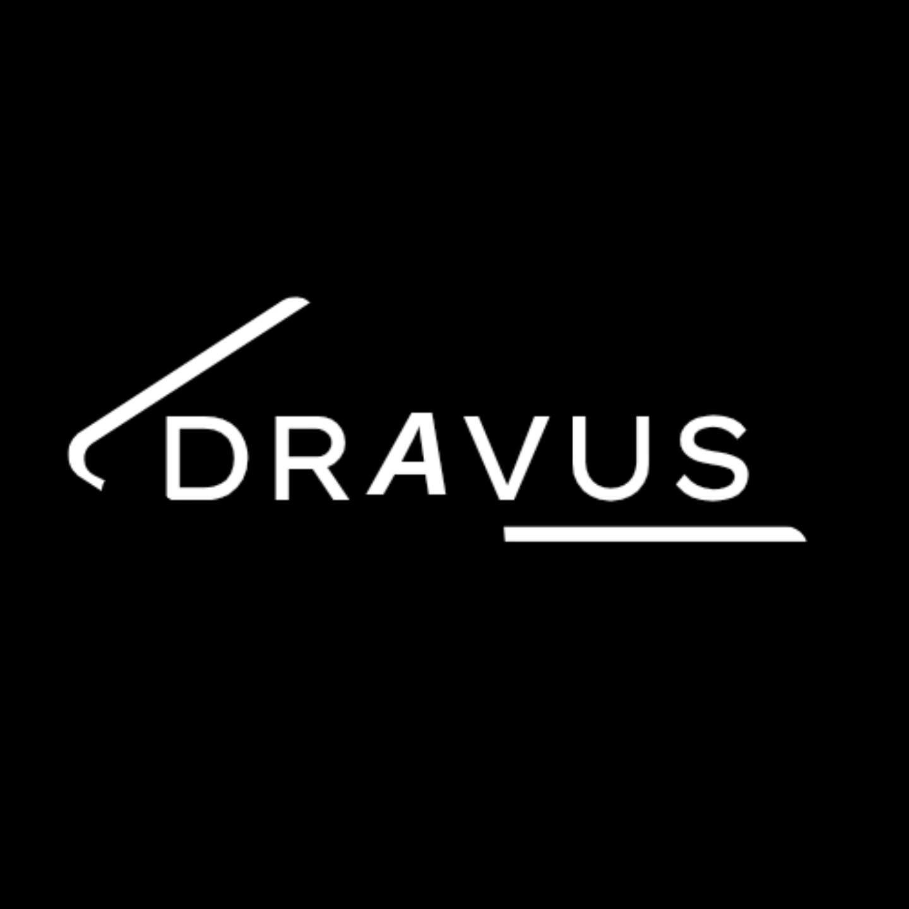
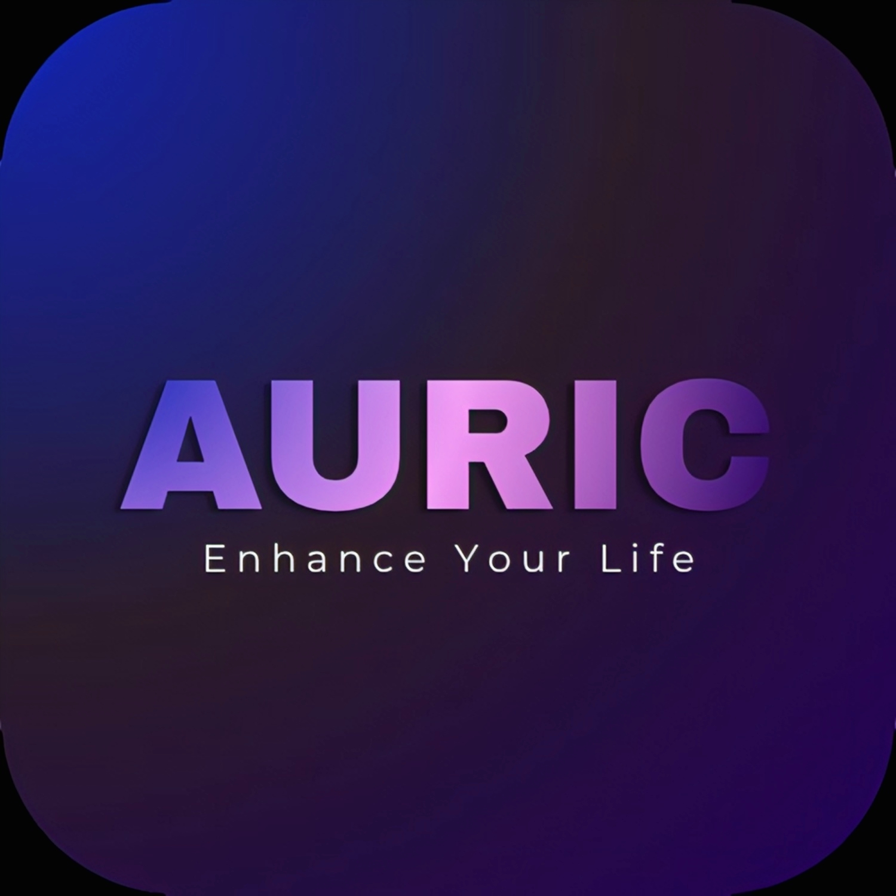
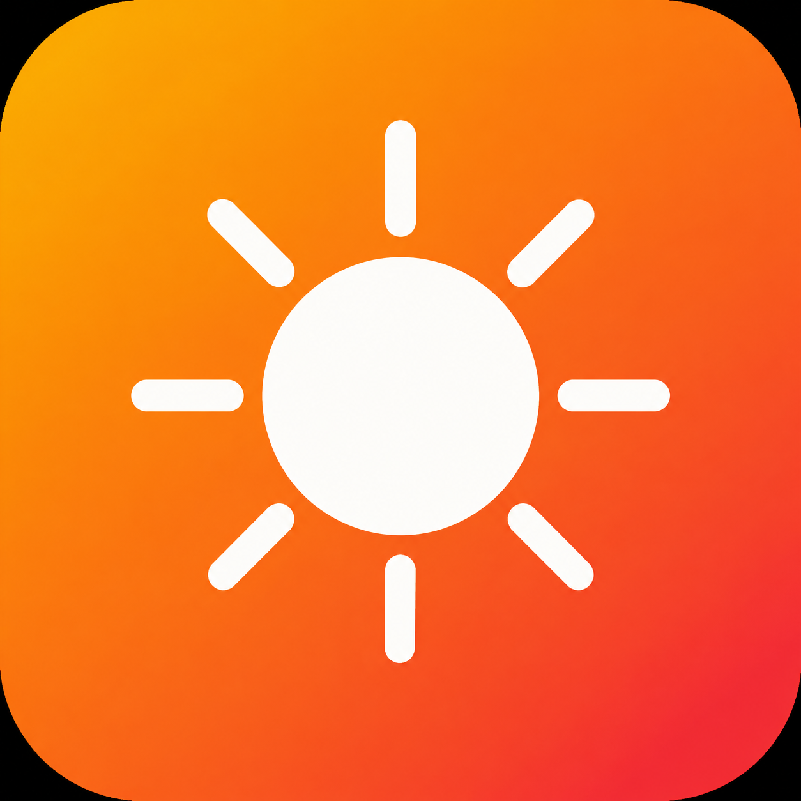

<div align="center">

<br>



<br><br>

# D R A V U S

**Mobile Development — Mindfulness · Wellness · Utility**

<br>

[](https://drazoldravus.github.io/developer-home/)
&nbsp;&nbsp;
[](mailto:dravus@zohomail.in)

<br>

<sub>

`BREATHWORK` · `MINDFULNESS` · `FOCUS` · `WELLNESS` · `SMOOTH UI` · `OFFLINE MODE`

</sub>

<br>

---

<br>

*I design and ship mobile apps focused on health, mindfulness, and everyday utility.*
*Things people actually use — not things that collect dust on app stores.*

*No bloat. No ads. Just clean software built with care.*

<br>

</div>

---

<br>

<table>
<tr>
<td width="60" align="center">
<br>

<br><br>
</td>
<td>

### AURIC &nbsp; 

> *breathe · focus · live*

A minimalist approach to mindfulness. Science-backed breathing cycles designed to help you reclaim focus in a world of constant noise. Make it a lifestyle.

</td>
</tr>
</table>

<table>
<tr><td>

| | Feature |
|:---:|:---|
| ◈ | **15 Science-Backed Exercises** — curated breathing patterns grounded in research |
| ◈ | **Multi-User Breathing Sessions** — breathe in sync with others, anywhere |
| ◈ | **Global Leaderboard** — compete on consistency with practitioners worldwide |
| ◈ | **Offline Mode Ready** — your phone, your data, no excuses |

</td></tr>
</table>

<p align="center">
<a href="https://github.com/drazoldravus/developer-home/releases/download/auric-v1.1.2/auric-release.apk">

</a>
</p>

<br>

---

<br>

<table>
<tr>
<td width="60" align="center">
<br>

<br><br>
</td>
<td>

### LUMIO &nbsp; 

> *light · utility · clarity*

A flashlight app for people who want more than a toggle. No ads. No bloat — just beautiful, functional light at your fingertips.

</td>
</tr>
</table>

<table>
<tr><td>

| | Feature |
|:---:|:---|
| ◈ | **Torch with Brightness Control** — fine-tuned light exactly when you need it |
| ◈ | **Strobe with Adjustable Speed** — customizable flash frequency |
| ◈ | **SOS Emergency Flash** — international distress signal at one tap |
| ◈ | **Morse Code Encoder** — type a message, flash it in morse |

</td></tr>
</table>

<p align="center">
<a href="https://github.com/drazoldravus/developer-home/releases/download/lumio-v1.0.0/lumio-release.apk">

</a>
</p>

<br>

---

<br>

<div align="center">

### ⚙ &nbsp; Stack & Tools

<br>

| Layer | Technology |
|---:|:---|
| **Mobile** | `Flutter` · `Dart` |
| **Design** | `Figma` |
| **Backend** | `Supabase` |
| **Hosting** | `GitHub Pages` |
| **Analytics** | `Custom Leaderboard System` |

<br>

</div>

---

<br>

<div align="center">

### ◇ &nbsp; Philosophy

<br>

> *Good software doesn't shout. It just works.*

<br>

</div>

<table>
<tr>
<td align="center" width="33%">

**ZERO BLOAT**

If it doesn't serve the user, it's gone.

</td>
<td align="center" width="33%">

**INTENTIONAL DESIGN**

Every screen has a reason to look the way it does.

</td>
<td align="center" width="33%">

**OFFLINE-FIRST**

Your phone, your data, no excuses.

</td>
</tr>
</table>

<br>

---

<br>

<div align="center">

### ◇ &nbsp; Setup — Self-Hosting

</div>

<br>

This site uses **Supabase** for the live leaderboard. To run your own instance:

```
1.  Clone the repo
2.  Copy config.example.js → config.js
3.  Replace the placeholder credentials with your Supabase keys
4.  Never commit config.js to version control
```

```js
const APP_CONFIG = Object.freeze({
  SUPABASE_URL: 'https://your-project.supabase.co',
  SUPABASE_ANON_KEY: 'your_anon_key_here',
});
```

<br>

---

<br>

<div align="center">

| | |
|:---:|:---|
| 🌐 | [**Portfolio**](https://drazoldravus.github.io/developer-home/) |
| 📧 | [**Support**](mailto:dravus@zohomail.in) |
| 📋 | [**Legal & Privacy**](https://drazoldravus.github.io/developer-home/legal.html) |
| 🐙 | [**GitHub**](https://github.com/drazoldravus) |

<br><br>

<sub>

**© 2026 DRAVUS. All rights reserved.**

BUILT IN INDIA &nbsp; · &nbsp; WITH INTENTION

</sub>

<br>

</div>
